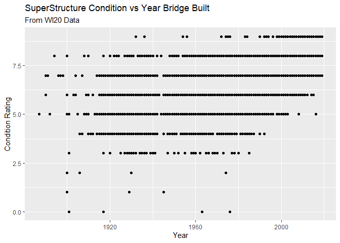

Stat433Hw1
================

## R Markdown

HW 1 for Stat 433

``` r
library(readr)
```

    ## Warning: package 'readr' was built under R version 4.1.1

``` r
library(ggplot2)
```

    ## Warning: package 'ggplot2' was built under R version 4.1.1

``` r
data <- read_csv("C:/Users/Jake reiners/Desktop/WI20.txt")
```

    ## Rows: 14271 Columns: 123

    ## -- Column specification --------------------------------------------------------
    ## Delimiter: ","
    ## chr (49): STRUCTURE_NUMBER_008, ROUTE_NUMBER_005D, HIGHWAY_DISTRICT_002, COU...
    ## dbl (72): STATE_CODE_001, RECORD_TYPE_005A, ROUTE_PREFIX_005B, SERVICE_LEVEL...
    ## lgl  (2): CRITICAL_FACILITY_006B, TEMP_STRUCTURE_103

    ## 
    ## i Use `spec()` to retrieve the full column specification for this data.
    ## i Specify the column types or set `show_col_types = FALSE` to quiet this message.

``` r
dataMod <- dplyr::filter(data, SUPERSTRUCTURE_COND_059 != "N")

dataMod$SUPERSTRUCTURE_COND_059 <- as.integer(dataMod$SUPERSTRUCTURE_COND_059)
bridgeviz <- ggplot(dataMod, aes(x=YEAR_BUILT_027, y=SUPERSTRUCTURE_COND_059)) + geom_point() +
labs(title="SuperStructure Condition vs Year Bridge Built", subtitle="From WI20 Data ", y="Condition Rating", x="Year")

plot(bridgeviz)
```

<!-- -->
